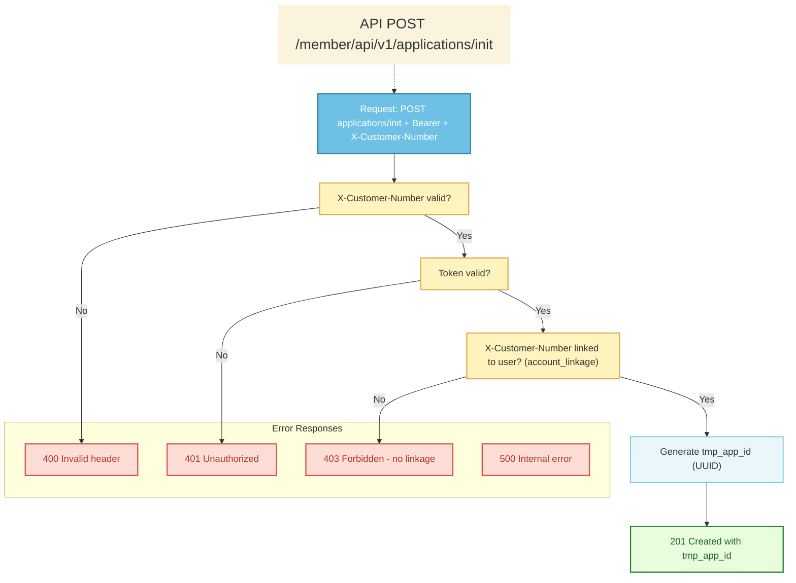
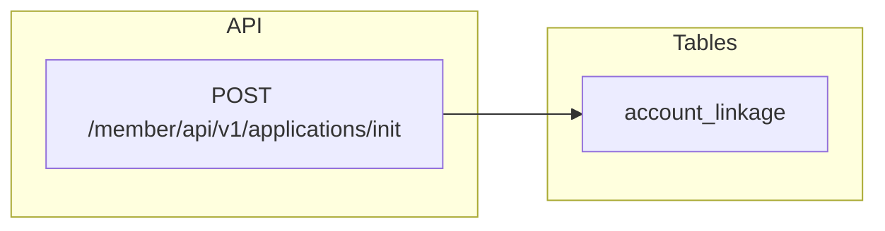

# Generate Temp Application ID API

## API Information

| Field | Value |
|-------|--------|
| **API Name** | Generate Temp Application ID |
| **Purpose** | Issue a temporary application ID (tmp_app_id) for the authenticated user to create a new draft application; the ID is used for temp-applications upload/list/delete and for final submit (POST /member/api/v1/application). |
| **HTTP Method** | POST |
| **Endpoint** | `/member/api/v1/applications/init` |
| **STG** | TBD |
| **PROD** | TBD |
| **Authentication** | Bearer token |

**Precondition:** The authenticated user must have completed account linkage. The API validates this and returns 403 (result 4) if not.

**Required symbol legend:** ○ = Required

---

## Request

### Header

| Column | Required | Value | Description |
|--------|----------|-------|-------------|
| Accept | ○ | `application/json` | |
| Content-Type | ○ | `application/json` | Request charset should be UTF-8. |
| Authorization | ○ | `Bearer &#60;access_token&#62;` | Authenticated user. |
| X-Customer-Number | ○ | String | Customer number (JHF). Must belong to the authenticated user (via account_linkage). |

### Sample Request URL

```
POST https://`domain`/member/api/v1/applications/init
```

### Request Body

None. No request body required.

#### Sample Request

```http
POST /member/api/v1/applications/init HTTP/1.1
Host: `domain`
Authorization: Bearer &#60;access_token&#62;
X-Customer-Number: &#60;customer_number&#62;
Content-Type: application/json; charset=UTF-8
Accept: application/json
```

---

## Response

### Success Response

#### Header (Success Case)

| Column | Required | Type | Constraint | Description |
|--------|----------|------|------------|-------------|
| Http Status Code | ○ | | | 201 |

#### JSON Body (Success Case)

| Column | Required | Type | Description |
|--------|----------|------|-------------|
| result | ○ | Integer | Result code. Should be 0 in success case. |
| tmp_app_id | ○ | String | Temp application id (UUID). Use in temp-applications upload/list/delete and in POST /member/api/v1/application for submit. |

#### Sample Success Response

```json
{
  "result": 0,
  "tmp_app_id": "018e1234-5678-7890-abcd-ef1234567890"
}
```

---

## Error Response

### Header (Error Case)

| Column | Required | Type | Constraint | Description |
|--------|----------|------|------------|-------------|
| Http Status Code | ○ | | | 400 / 401 / 403 / 409 / 500 / 503 / 504 |

### JSON Body (Error Case)

| Column | Required | Type | Description |
|--------|----------|------|-------------|
| result | ○ | Integer | Result code. See table below. |
| error_message | ○ | String | Error message. |

### Result Code and HTTP Status

| Code | HTTP Status | Description | Type | Error Message |
|------|-------------|-------------|------|---------------|
| 1 | 400 | Invalid or missing X-Customer-Number header | Client Error | Request parameter is invalid. |
| 2 | 500 | Internal server error (e.g. DB connection error) | Internal Server Error | A system error has occurred. |
| 3 | 401 | User not authenticated | Unauthorized | Authentication is required. |
| 4 | 403 | Account linkage not completed; or X-Customer-Number not linked to user | Forbidden | Please complete account linkage first. |
| 5 | 409 | tmp_app_id already used for a submitted application | Conflict | This application ID has already been used. |
| 6 | 503 | Service temporarily unavailable | Service Unavailable | The service is temporarily unavailable. |
| 7 | 504 | Gateway or upstream timeout | Gateway Timeout | Request timed out. |

---

## Process Flow



---

## Data access: CRUD and sample SQL

This API does **not** write to the database. The backend **reads** `account_linkage` to verify the request header `X-Customer-Number` is linked to the authenticated user (easy_id); if missing/invalid or not linked, the API returns 400 (result 1) or 403 (result 4). Only then does it generate a new UUID (`tmp_app_id`) and return it; the value is not persisted until the client submits via POST /member/api/v1/application.



### Tables used

| Table | CRUD | Purpose |
|-------|------|---------|
| **account_linkage** | R | Verify X-Customer-Number is linked to easy_id. If no row for (easy_id, customer_number) → 403 (result 4). Required before issuing tmp_app_id. |

No Create, Update, or Delete. No persistence of tmp_app_id at init.

### Sample SQL

**Check X-Customer-Number linked to user (403 if not linked)**

```sql
-- Ensure X-Customer-Number from request header is linked to the authenticated user (easy_id)
SELECT 1
FROM account_linkage
WHERE easy_id = :easy_id
  AND customer_number = :customer_number  -- from X-Customer-Number header
LIMIT 1;
-- If no row → return 403 (result 4). Else generate UUID and return 201 with tmp_app_id.
```
