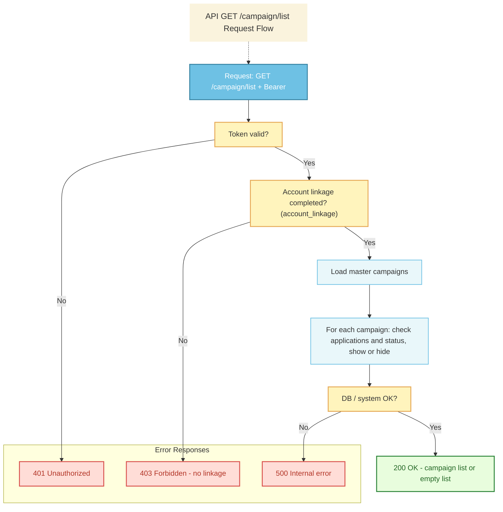
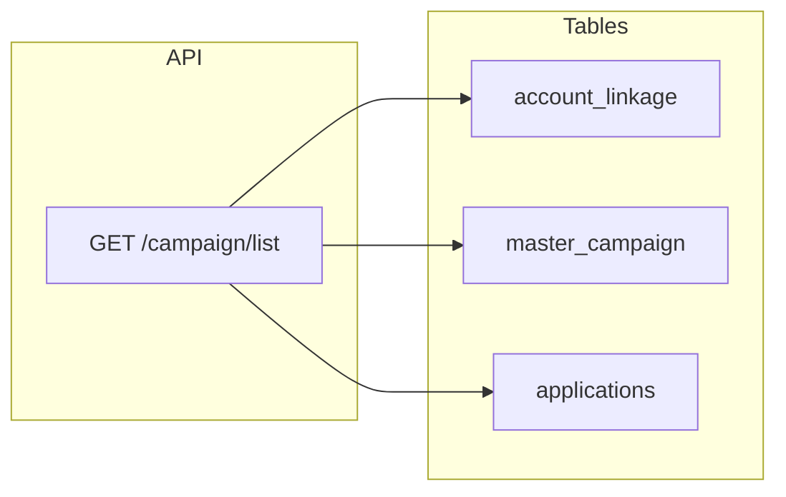

# Campaign List API Interface


## API Information
| Field | Value |
|-------|--------|
| **API Name** | Retrieve Campaign List API |
| **Description** | Return the list of campaigns available to the authenticated user. |
| **HTTP Method** | GET |
| **Endpoint** | `/campaign/list` |
| **STG** | TBD |
| **PROD** | TBD |
| **Authentication** | Bearer token |

**Required symbol legend:** ○ = Required

---

## Request

### Header

| Column | Required | Value | Description |
|--------|----------|-------|-------------|
| Accept | ○ | `application/json` | |
| Content-Type | ○ | `application/json` | Request charset should be UTF-8. |
| Authorization | ○ | `Bearer &#60;access_token&#62;` | Authenticated user. |

### Sample Request URL

```
GET https://`domain`/campaign/list
```

---

## Response

### Success Response

#### Header (Success Case)

| Column | Required | Type | Constraint | Description |
|--------|----------|------|------------|-------------|
| Http Status Code | ○ | | | 200 |

#### JSON Body (Success Case)

| Column | Required | Type | Description |
|--------|----------|------|-------------|
| result | ○ | Integer | Result code. Should be 0 in success case. |
| campaigns | ○ | Array | List of available campaigns. Each item has id, title, brief_eligibility, point_amount, required_documents, point_grant_date. |

**Each campaign item in `campaigns`:**

| Column | Required | Type | Description |
|--------|----------|------|-------------|
| id | ○ | Integer | Campaign ID (from master_campaign). |
| title | ○ | String | Campaign title. |
| brief_eligibility | ○ | Array of String | Eligibility conditions as separate strings. |
| point_amount | ○ | Number | Point amount (exact value). |
| required_documents | ○ | Array of Object | List of required document types. Each object: id and title (e.g. doc_1, 融資実行確認書類). |
| point_grant_date | ○ | String | Scheduled point grant date in **ISO 8601 date** format: `YYYY-MM-DD` (e.g. `2025-12-31`). |

#### Sample Success Response

```json
{
  "result": 0,
  "campaigns": [
    {
      "id": 1,
      "title": "新規ご契約特典",
      "brief_eligibility": [
        "2026年10月1日以降に住宅ローンの融資が実行されていること",
        "同一債権に対するポイント申請1回限りとします",
        "融資実行日から〇ヶ月以内に申請すること"
      ],
      "point_amount": 5000,
      "required_documents": [
        { "id": "doc_1", "title": "融資実行確認書類" }
      ],
      "point_grant_date": "2025-12-31"
    },
    {
      "id": 2,
      "title": "ご子息誕生お祝い特典",
      "brief_eligibility": [
        "2026年10月1日以降に住宅ローンの融資が実行されていること",
        "同一債権に対するポイント申請1回限りとします",
        "融資実行日から〇ヶ月以内に申請すること"
      ],
      "point_amount": 30000,
      "required_documents": [
        { "id": "doc_1", "title": "融資実行確認書類" }
      ],
      "point_grant_date": "2025-01-31"
    }
  ]
}
```

---

## Error Response

### Header (Error Case)

| Column | Required | Type | Constraint | Description |
|--------|----------|------|------------|-------------|
| Http Status Code | ○ | | | 401 / 403 / 500 / 503 / 504 |


### JSON Body (Error Case)

| Column | Required | Type | Description |
|--------|----------|------|-------------|
| result | ○ | Integer | Result code. See table below. |
| error_message | ○ | String | Error message. |

### Result Code and HTTP Status (Error cases only)

| Code | HTTP Status | Description | Type | Error Message |
|------|-------------|-------------|------|---------------|
| 1 | 401 | Missing or invalid Bearer token; user not authenticated | Unauthorized | Authentication is required. |
| 2 | 403 | Forbidden: account linkage not completed, or user not allowed to access campaign list | Forbidden | Please complete account linkage first. |
| 3 | 500 | Internal server error (e.g. DB connection error) | Internal Server Error | A system error has occurred. |
| 4 | 503 | Service temporarily unavailable | Service Unavailable | The service is temporarily unavailable. |
| 5 | 504 | Gateway or upstream timeout | Gateway Timeout | Request timed out. |

**Success with no campaigns:** The API returns **200 OK** with `result: 0` and `campaigns: []` when the user is allowed but there are no eligible campaigns (e.g. already applied to all). This is not an error response.

---

## Process Flow



---

## Data access: CRUD and sample SQL

**Note:** Master data (`master_campaign`) must be pre-configured in the DB before calling this endpoint.



### Tables used

| Table | CRUD | Purpose |
|-------|------|---------|
| **account_linkage** | R | Verify user (easy_id) has completed account linkage. If no row → 403 (result 2). |
| **master_campaign** | R | Campaign definitions (title, eligibility, point amount, required documents). |
| **applications** | R | Check per user/customer: campaign_id, application_status to show or hide campaign. |

### Sample SQL

**Validate linkage** (403 if user has no linkage for this customer)

```sql
SELECT 1
FROM account_linkage
WHERE easy_id = :easy_id
  AND customer_number = :customer_number;
-- If no row → return 403 (result 2). Else proceed to load campaigns.
```

**Fetch campaigns to show** (for the authenticated user’s linked customer number(s); logic may resolve customer from easy_id)

```sql
SELECT
    mc.id AS campaign_id,
    mc.title,
    mc.brief_eligibility,
    mc.point_amount,
    mc.required_documents
FROM master_campaign mc
WHERE NOT EXISTS (
    SELECT 1
    FROM applications a
    WHERE a.customer_number = :customer_number
      AND a.campaign_id = mc.id
      AND a.application_status IN (
          'Under review', 'Final approved', 'Grant Done'
      )
)
ORDER BY mc.id;
```

**Master data: insert**

```sql
INSERT INTO master_campaign (
    title,
    brief_eligibility,
    point_amount,
    required_documents
) VALUES
(
    '新規ご契約特典',
    '・2026年10月1日以降に住宅ローンの融資が実行されていること\n・同一債権に対するポイント申請1回限りとします',
    5000,
    '融資実行確認書類'
),
(
    'ご子息誕生お祝い特典',
    '・2026年10月1日以降に住宅ローンの融資が実行されていること\n・同一債権に対するポイント申請1回限りとします',
    30000,
    '融資実行確認書類'
);
```

