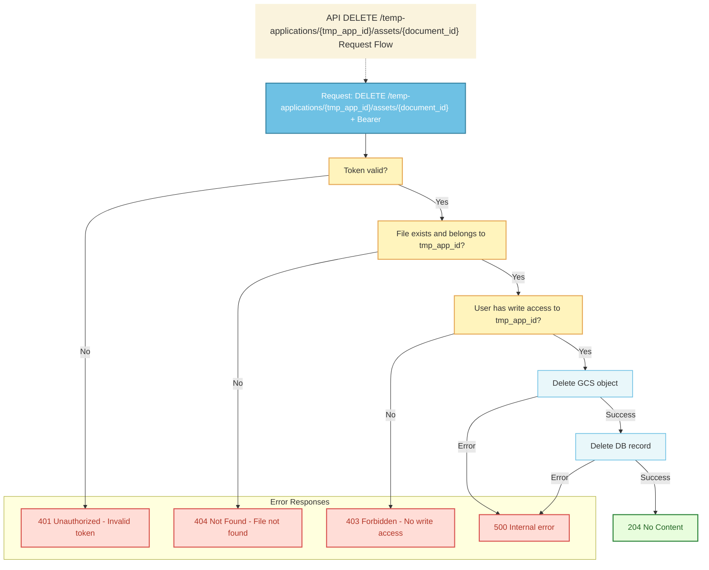

# File Delete API Interface

## API Information

| Field | Value |
|-------|--------|
| **API Name** | Delete a File API |
| **Description** | Permanently removes a file (both metadata and the actual object in Google Cloud Storage). |
| **HTTP Method** | DELETE |
| **Endpoint** | `/temp-applications/{tmp_app_id}/assets/{document_id}` |
| **STG** | TBD |
| **PROD** | TBD |
| **Authentication** | Bearer token |

**Required symbol legend:** ○ = Required

---

## Request

### Path Parameters

| Column | Required | Type | Description |
|--------|----------|------|-------------|
| tmp_app_id | ○ | string (VARCHAR(36)) | The temporary application ID. |
| document_id | ○ | string (VARCHAR(30)) | The document ID to delete. |

### Header

| Column | Required | Value | Description |
|--------|----------|-------|-------------|
| Accept | ○ | `application/json` | |
| Authorization | ○ | `Bearer &#60;access_token&#62;` | Authenticated user. |

### Sample Request URL

```
DELETE https://`domain`/temp-applications/550e8400-e29b-41d4-a716-446655440000/assets/DOC20250326001
```

---

## Response

### Success Response

#### Header (Success Case)

| Column | Required | Type | Constraint | Description |
|--------|----------|------|------------|-------------|
| Http Status Code | ○ | | | 204 No Content |

**Note:** No response body is returned for successful deletion.

---

## Error Response

### Header (Error Case)

| Column | Required | Type | Constraint | Description |
|--------|----------|------|------------|-------------|
| Http Status Code | ○ | | | 401 / 403 / 404 / 500 |

### JSON Body (Error Case)

| Column | Required | Type | Description |
|--------|----------|------|-------------|
| result | ○ | Integer | Result code. See table below. |
| error_message | ○ | String | Error message. |

### Result Code and HTTP Status (Error cases only)

| Code | HTTP Status | Description | Type | Error Message |
|------|-------------|-------------|------|---------------|
| 3 | 401 | Missing or invalid JWT | Unauthorized | 認証が必要です。 |
| 4 | 403 | User does not have write access to this resource | Forbidden | このリソースへの書き込み権限がありません。 |
| 3 | 404 | The file does not exist or does not belong to the given tmp_app_id | Not Found | ファイルが見つかりません。 |
| 2 | 500 | Internal server error | Internal Server Error | システムエラーが発生しました。 |

---

## Process Flow



---

## Data access: CRUD and sample SQL

**Note:** The `documents` table must exist in the DB before calling this endpoint.

```mermaid
flowchart LR
  subgraph Tables
    A[documents]
  end
  subgraph External
    B[Google Cloud Storage]
  end
  subgraph API
    C[DELETE /temp-applications/{tmp_app_id}/assets/{document_id}]
  end
  C --> A
  C --> B
```

### Tables used

| Table | CRUD | Purpose |
|-------|------|---------|
| **documents** | R, D | Read document metadata to get GCS path (document_path), then delete the record. |

### Sample SQL

**Get document metadata and verify ownership** (404 if document not found)

```sql
SELECT 
    d.document_id,
    d.temp_application_id,
    d.document_path,
    d.original_document_name
FROM documents d
WHERE d.document_id = :document_id
  AND d.temp_application_id = :tmp_app_id;
-- If no row → return 404 (result 3). Else proceed to delete.
```

**Verify user has write access** (403 if user has no write access)

```sql
-- Note: Adjust based on your temp_applications table structure
SELECT temp_application_id, easy_id
FROM temp_applications
WHERE temp_application_id = :tmp_app_id
  AND easy_id = :easy_id;
-- If no row → return 403 (result 4). Else proceed.
```

**Delete document record**

```sql
DELETE FROM documents
WHERE document_id = :document_id
  AND temp_application_id = :tmp_app_id;
```

**GCS Object Deletion**

The GCS object is deleted using the stored `document_path`:
- Path: From `documents.document_path` column
- Method: Delete object from bucket
- If object doesn't exist in GCS, still proceed with DB deletion (idempotent)

**Transaction Safety**

Consider using a transaction to ensure both operations succeed or fail together:
1. Delete GCS object
2. Delete DB record

If GCS deletion fails, rollback the transaction. If DB deletion fails, attempt to restore the GCS object if possible, or log the inconsistency.
