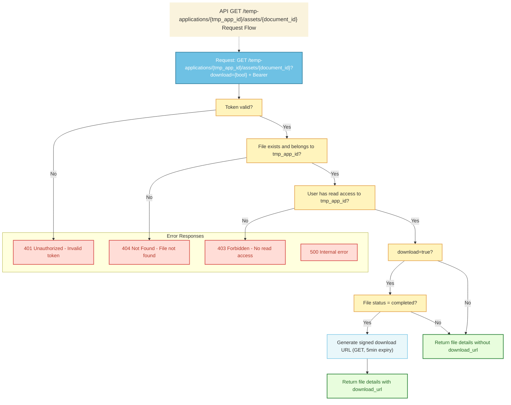

# File Details API Interface

## API Information

| Field | Value |
|-------|--------|
| **API Name** | Get File Details API |
| **Description** | Retrieves metadata of a specific file. Optionally returns a signed download URL for the file. |
| **HTTP Method** | GET |
| **Endpoint** | `/temp-applications/{tmp_app_id}/assets/{document_id}` |
| **STG** | TBD |
| **PROD** | TBD |
| **Authentication** | Bearer token |

**Required symbol legend:** ○ = Required

---

## Request

### Path Parameters

| Column | Required | Type | Description |
|--------|----------|------|-------------|
| tmp_app_id | ○ | string (VARCHAR(36)) | The temporary application ID. |
| document_id | ○ | string (VARCHAR(30)) | The document ID. |

### Query Parameters

| Column | Required | Type | Description |
|--------|----------|------|-------------|
| download | No | boolean | If true, includes a signed download URL in the response. |

### Header

| Column | Required | Value | Description |
|--------|----------|-------|-------------|
| Accept | ○ | `application/json` | |
| Authorization | ○ | `Bearer &#60;access_token&#62;` | Authenticated user. |

### Sample Request URL

```
GET https://`domain`/temp-applications/550e8400-e29b-41d4-a716-446655440000/assets/660e8400-e29b-41d4-a716-446655440001?download=true
```

---

## Response

### Success Response

#### Header (Success Case)

| Column | Required | Type | Constraint | Description |
|--------|----------|------|------------|-------------|
| Http Status Code | ○ | | | 200 OK |

#### JSON Body (Success Case)

| Column | Required | Type | Description |
|--------|----------|------|-------------|
| result | ○ | Integer | Result code. Should be 0 in success case. |
| document_id | ○ | string (VARCHAR(30)) | Unique document identifier. |
| filename | ○ | string | Original file name (original_document_name). |
| mime_type | ○ | string | MIME type of the file. |
| size | ○ | integer | File size in bytes (document_size, SMALLINT). |
| pages | ○ | integer | Number of pages (document_pages, SMALLINT). |
| created_at | ○ | string (ISO 8601) | File creation timestamp. |
| updated_at | ○ | string (ISO 8601) | File last update timestamp. |
| download_url | No | string (URI) | Signed download URL (only if download=true and file exists). |

#### Sample Success Response (with download URL)

```json
{
  "result": 0,
  "document_id": "660e8400-e29b-41d4-a716-446655440001",
  "filename": "report.pdf",
  "mime_type": "application/pdf",
  "size": 1048576,
  "status": "completed",
  "created_at": "2025-03-26T10:00:00Z",
  "updated_at": "2025-03-26T10:00:00Z",
  "download_url": "https://storage.googleapis.com/bucket/temp-applications/550e8400-e29b-41d4-a716-446655440000/assets/660e8400-e29b-41d4-a716-446655440001/report.pdf?X-Goog-Signature=..."
}
```

#### Sample Success Response (without download URL)

```json
{
  "result": 0,
  "document_id": "660e8400-e29b-41d4-a716-446655440001",
  "filename": "report.pdf",
  "mime_type": "application/pdf",
  "size": 1048576,
  "status": "completed",
  "created_at": "2025-03-26T10:00:00Z",
  "updated_at": "2025-03-26T10:00:00Z"
}
```

---

## Error Response

### Header (Error Case)

| Column | Required | Type | Constraint | Description |
|--------|----------|------|------------|-------------|
| Http Status Code | ○ | | | 401 / 403 / 404 / 500 |

### JSON Body (Error Case)

| Column | Required | Type | Description |
|--------|----------|------|-------------|
| result | ○ | Integer | Result code. See table below. |
| error_message | ○ | String | Error message. |

### Result Code and HTTP Status (Error cases only)

| Code | HTTP Status | Description | Type | Error Message |
|------|-------------|-------------|------|---------------|
| 3 | 401 | Missing or invalid JWT | Unauthorized | 認証が必要です。 |
| 4 | 403 | User does not have read access | Forbidden | このリソースへの読み取り権限がありません。 |
| 3 | 404 | File not found | Not Found | ファイルが見つかりません。 |
| 2 | 500 | Internal server error | Internal Server Error | システムエラーが発生しました。 |

---

## Process Flow



---

## Data access: CRUD and sample SQL

**Note:** The `temp_applications` and `documents` tables must exist in the DB before calling this endpoint.

```mermaid
flowchart LR
  subgraph Tables
    A[temp_applications]
    B[documents]
  end
  subgraph External
    C[Google Cloud Storage]
  end
  subgraph API
    D[GET /temp-applications/{tmp_app_id}/assets/{document_id}]
  end
  D --> A
  D --> B
  D --> C
```

### Tables used

| Table | CRUD | Purpose |
|-------|------|---------|
| **temp_applications** | R | Verify tmp_app_id exists and user has read access. If no row or no access → 403 (result 4). |
| **documents** | R | Retrieve file metadata (document_id, filename, mime_type, size, status, timestamps, gcs_path). |

### Sample SQL

**Validate tmp_app_id and user access** (403 if user has no read access)

```sql
SELECT ta.tmp_app_id, ta.easy_id
FROM temp_applications ta
WHERE ta.tmp_app_id = :tmp_app_id
  AND ta.easy_id = :easy_id;
-- If no row → return 403 (result 4). Else proceed.
```

**Get document details** (404 if document not found)

```sql
SELECT 
    d.document_id,
    d.original_document_name,
    d.mime_type,
    d.document_size,
    d.document_pages,
    d.document_path,
    d.created_at,
    d.updated_at
FROM documents d
WHERE d.document_id = :document_id
  AND d.temp_application_id = :tmp_app_id;
-- If no row → return 404 (result 3). Else return document details.
```

**GCS Signed Download URL Generation**

If `download=true` query parameter is provided:
- Generate a V4 signed URL using Google Cloud Storage API
- Method: GET
- Expiry: 5 minutes from generation time
- Path: From `documents.document_path` column
- Include the `download_url` in the response

If `download=false`, exclude `download_url` from the response.
