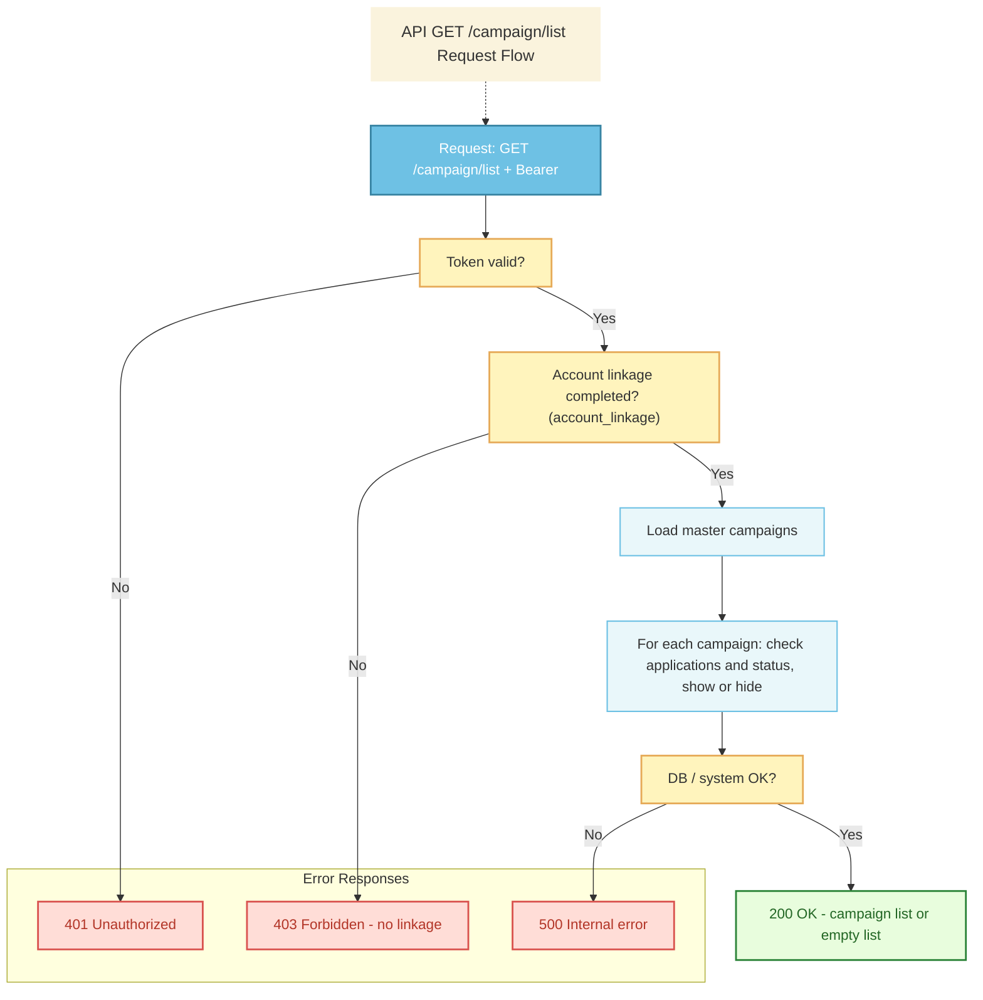
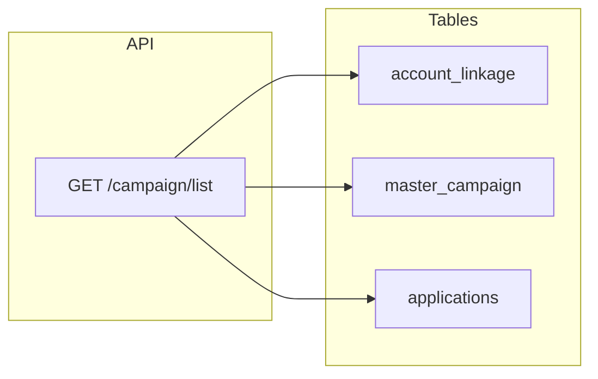

You are a senior QA engineer with expertise in API testing. Based on the API Spec in Markdown format below, design comprehensive test cases covering:

- Please refer to my test case template; all content must include
---
The following is the content of the Case template:

# Retrieve Campaign List API – Test Cases

| Spec           | `Campaign_List_API_Interface.md` |
|----------------|----------------------------------|
| Endpoint       | GET `/campaign/list`            |
| Authentication | Bearer token                    |
| Note           | No DB update.                  |

---

## API overview

**API name:** Retrieve Campaign List API  
**Description:** Return the list of campaigns available to the authenticated user.

---

## Sample success response

```json
{
  "result": 0,
  "campaigns": [
    {
      "id": 1,
      "title": "新規ご契約特典",
      "brief_eligibility": [
        "2026年10月1日以降に住宅ローンの融資が実行されていること",
        "同一債権に対するポイント申請1回限りとします",
        "融資実行日から〇ヶ月以内に申請すること"
      ],
      "point_amount": 5000,
      "required_documents": [
        { "id": "doc_1", "title": "融資実行確認書類" }
      ],
      "point_grant_date": "2025-12-31"
    },
    {
      "id": 2,
      "title": "ご子息誕生お祝い特典",
      "brief_eligibility": [
        "2026年10月1日以降に住宅ローンの融資が実行されていること",
        "同一債権に対するポイント申請1回限りとします",
        "融資実行日から〇ヶ月以内に申請すること"
      ],
      "point_amount": 30000,
      "required_documents": [
        { "id": "doc_1", "title": "融資実行確認書類" }
      ],
      "point_grant_date": "2025-01-31"
    }
  ]
}
```

---


## Test Case Summary Matrix

| Case ID                      | Category        | Priority | Test Description                                             | Note |
| ---------------------------- | --------------- | -------- | ------------------------------------------------------------ | ---- |
| TC-API-CAMPAIGN-LIST-HP-001  | HappyPath       | L1       | Retrieve campaigns successfully with valid token and linkage |      |
| TC-API-CAMPAIGN-LIST-HP-003  | HappyPath       | L2       | Retrieve empty campaign list when all campaigns applied      |      |
| TC-API-CAMPAIGN-LIST-HP-003  | HappyPath       | L2       | Retrieve campaigns with multiple required documents          |      |
| TC-API-CAMPAIGN-LIST-REQ-001 | RequiredCheck   | L1       | Missing Authorization header validation                      |      |
| TC-API-CAMPAIGN-LIST-REQ-002 | RequiredCheck   | L2       | Missing Accept header validation                             |      |
| TC-API-CAMPAIGN-LIST-REQ-003 | RequiredCheck   | L2       | Missing Content-Type header validation                       |      |
| TC-API-CAMPAIGN-LIST-REQ-004 | RequiredCheck   | L1       | Empty Bearer token value                                     |      |
| TC-API-CAMPAIGN-LIST-REQ-005 | RequiredCheck   | L1       | Bearer token without prefix                                  |      |
| TC-API-CAMPAIGN-LIST-LEN-001 | LengthCheck     | L2       | Point amount boundary: zero value                            |      |
| TC-API-CAMPAIGN-LIST-LEN-002 | LengthCheck     | L2       | Point amount boundary: maximum value                         |      |
| TC-API-CAMPAIGN-LIST-LEN-003 | LengthCheck     | L2       | Campaign title with maximum length                           |      |
| TC-API-CAMPAIGN-LIST-LEN-004 | LengthCheck     | L3       | Brief eligibility with many conditions                       |      |
| TC-API-CAMPAIGN-LIST-LEN-005 | LengthCheck     | L3       | Required documents with many items                           |      |
| TC-API-CAMPAIGN-LIST-LEN-006 | LengthCheck     | L3       | Point grant date boundary: minimum date                      |      |
| TC-API-CAMPAIGN-LIST-LEN-007 | LengthCheck     | L4       | Point grant date boundary: maximum date                      |      |
| TC-API-CAMPAIGN-LIST-VAL-001 | ValidationCheck | L2       | Bearer token with special characters                         |      |
| TC-API-CAMPAIGN-LIST-VAL-002 | ValidationCheck | L3       | Campaign title with special characters                       |      |
| TC-API-CAMPAIGN-LIST-VAL-003 | ValidationCheck | L3       | Brief eligibility with special characters                    |      |
| TC-API-CAMPAIGN-LIST-VAL-004 | ValidationCheck | L3       | Document title with special characters                       |      |
| TC-API-CAMPAIGN-LIST-VAL-005 | ValidationCheck | L1       | Point grant date format validation                           |      |
| TC-API-CAMPAIGN-LIST-VAL-006 | ValidationCheck | L3       | Campaign ID format validation                                |      |
| TC-API-CAMPAIGN-LIST-VAL-007 | ValidationCheck | L1       | Result field is integer 0 on success                         |      |
| TC-API-CAMPAIGN-LIST-LOG-001 | LogicCheck      | L1       | Campaign hidden if approved application exists               |      |
| TC-API-CAMPAIGN-LIST-LOG-002 | LogicCheck      | L1       | Campaign hidden if under review application                  |      |
| TC-API-CAMPAIGN-LIST-LOG-003 | LogicCheck      | L1       | Campaign hidden if grant done application                    |      |
| TC-API-CAMPAIGN-LIST-LOG-004 | LogicCheck      | L2       | Campaign shown if rejected application                       |      |
| TC-API-CAMPAIGN-LIST-LOG-005 | LogicCheck      | L2       | Campaign shown if withdrawn application                      |      |
| TC-API-CAMPAIGN-LIST-LOG-006 | LogicCheck      | L2       | New campaign appears after insertion                         |      |
| TC-API-CAMPAIGN-LIST-LOG-007 | LogicCheck      | L1       | Multiple customer number isolation                           |      |
| TC-API-CAMPAIGN-LIST-LOG-008 | LogicCheck      | L3       | Campaigns ordered by ID ascending                            |      |
| TC-API-CAMPAIGN-LIST-ERR-001 | ErrorCheck      | L1       | Invalid or expired Bearer token                              |      |
| TC-API-CAMPAIGN-LIST-ERR-002 | ErrorCheck      | L1       | Account linkage not completed (403)                          |      |
| TC-API-CAMPAIGN-LIST-ERR-003 | ErrorCheck      | L1       | Database connection error (500)                              |      |
| TC-API-CAMPAIGN-LIST-ERR-004 | ErrorCheck      | L2       | Service temporarily unavailable (503)                        |      |
| TC-API-CAMPAIGN-LIST-ERR-005 | ErrorCheck      | L2       | Gateway or upstream timeout (504)                            |      |
| TC-API-CAMPAIGN-LIST-ERR-006 | ErrorCheck      | L1       | Malformed Authorization header                               |      |
| TC-API-CAMPAIGN-LIST-ERR-007 | ErrorCheck      | L1       | Wrong authentication scheme                                  |      |
| TC-API-CAMPAIGN-LIST-ERR-008 | ErrorCheck      | L1       | Response missing result field                                |      |
| TC-API-CAMPAIGN-LIST-ERR-009 | ErrorCheck      | L1       | Response missing campaigns field on success                  |      |
| TC-API-CAMPAIGN-LIST-ERR-010 | ErrorCheck      | L2       | Error response structure validation                          |      |

**Total Test Cases: 40**

---

## Test Cases by Classification

| Case ID                       | Category        | Priority | Test Description                                             | Given                                                                                                                            | When                                                                                                          | Then                                                                                          | Case Status | Note |
| ----------------------------- | --------------- | -------- | ------------------------------------------------------------ | -------------------------------------------------------------------------------------------------------------------------------- | ------------------------------------------------------------------------------------------------------------- | --------------------------------------------------------------------------------------------- | ----------- | ---- |
| TC-API-CAMPAIGN-LIST-HP-001   | HappyPath       | L1       | Retrieve campaigns successfully with valid token and linkage | 1. User has completed account linkage<br>2. User has not applied to all campaigns<br>3. DB has 2+ campaigns                      | 1. Send GET /campaign/list<br>2. Include valid Bearer token<br>3. Include Accept and Content-Type headers     | 1. HTTP 200<br>2. result=0<br>3. campaigns array with all required fields                     | Not Run     |      |
| TC-API-CAMPAIGN-LIST-HP-002   | HappyPath       | L2       | Retrieve empty campaign list when all campaigns applied      | 1. User has completed account linkage<br>2. User has applied to all campaigns (status: Under review, Final approved, Grant Done) | 1. Send GET /campaign/list with valid token and headers                                                       | 1. HTTP 200<br>2. result=0<br>3. campaigns=[]                                                 | Not Run     |      |
| TC-API-CAMPAIGN-LIST-HP-003   | HappyPath       | L2       | Retrieve campaigns with multiple required documents          | 1. User has completed account linkage<br>2. Campaigns have multiple required_documents                                           | 1. Send GET /campaign/list with valid token                                                                   | 1. HTTP 200<br>2. result=0<br>3. Each campaign's required_documents contains multiple objects | Not Run     |      |
| TC-API-CAMPAIGN-LIST-REQ-001  | RequiredCheck   | L1       | Missing Authorization header validation                      | 1. None                                                                                                                          | 1. Send GET /campaign/list<br>2. Omit Authorization header<br>3. Include other required headers               | 1. HTTP 401<br>2. result=1<br>3. error_message="Authentication is required."                  | Not Run     |      |
| TC-API-CAMPAIGN-LIST-REQ-002  | RequiredCheck   | L2       | Missing Accept header validation                             | 1. User has completed account linkage                                                                                            | 1. Send GET /campaign/list<br>2. Omit Accept header<br>3. Include Authorization and Content-Type              | 1. HTTP 200 or 400<br>2. If 200: valid campaign data                                          | Not Run     |      |
| TC-API-CAMPAIGN-LIST-REQ-003  | RequiredCheck   | L2       | Missing Content-Type header validation                       | 1. User has completed account linkage                                                                                            | 1. Send GET /campaign/list<br>2. Omit Content-Type header<br>3. Include Authorization and Accept              | 1. HTTP 200 or 400<br>2. If 200: valid campaign data                                          | Not Run     |      |
| TC-API-CAMPAIGN-LIST-REQ-004  | RequiredCheck   | L1       | Empty Bearer token value                                     | 1. None                                                                                                                          | 1. Set Authorization: "Bearer "<br>2. Send GET /campaign/list                                                 | 1. HTTP 401<br>2. result=1<br>3. error_message="Authentication is required."                  | Not Run     |      |
| TC-API-CAMPAIGN-LIST-REQ-005  | RequiredCheck   | L1       | Bearer token without prefix                                  | 1. None                                                                                                                          | 1. Set Authorization: "token_value_only"<br>2. Send GET /campaign/list                                        | 1. HTTP 401<br>2. result=1<br>3. error_message="Authentication is required."                  | Not Run     |      |
| TC-API-CAMPAIGN-LIST-LEN-001  | LengthCheck     | L2       | Point amount boundary: zero value                            | 1. master_campaign has campaign with point_amount=0                                                                              | 1. Send GET /campaign/list with valid token                                                                   | 1. HTTP 200<br>2. result=0<br>3. Campaign with point_amount=0 displayed as Number             | Not Run     |      |
| TC-API-CAMPAIGN-LIST-LEN-002  | LengthCheck     | L2       | Point amount boundary: maximum value                         | 1. master_campaign has campaign with point_amount=999999999                                                                      | 1. Send GET /campaign/list                                                                                    | 1. HTTP 200<br>2. result=0<br>3. Campaign with maximum point_amount displayed                 | Not Run     |      |
| TC-API-CAMPAIGN-LIST-LEN-003  | LengthCheck     | L2       | Campaign title with maximum length                           | 1. master_campaign has campaign with title length 255+ chars                                                                     | 1. Send GET /campaign/list                                                                                    | 1. HTTP 200<br>2. result=0<br>3. Full title returned                                          | Not Run     |      |
| TC-API-CAMPAIGN-LIST-LEN-004  | LengthCheck     | L3       | Brief eligibility with many conditions                       | 1. master_campaign has campaign with 10+ eligibility conditions                                                                  | 1. Send GET /campaign/list                                                                                    | 1. HTTP 200<br>2. result=0<br>3. All brief_eligibility items returned                         | Not Run     |      |
| TC-API-CAMPAIGN-LIST-LEN-005  | LengthCheck     | L3       | Required documents with many items                           | 1. master_campaign has campaign with 5+ required_documents                                                                       | 1. Send GET /campaign/list                                                                                    | 1. HTTP 200<br>2. result=0<br>3. All required_documents returned                              | Not Run     |      |
| TC-API-CAMPAIGN-LIST-LEN-006  | LengthCheck     | L3       | Point grant date boundary: minimum date                      | 1. master_campaign has campaign with point_grant_date="1970-01-01"                                                               | 1. Send GET /campaign/list                                                                                    | 1. HTTP 200<br>2. result=0<br>3. point_grant_date="1970-01-01"                                | Not Run     |      |
| TC-API-CAMPAIGN-LIST-LEN-007  | LengthCheck     | L4       | Point grant date boundary: maximum date                      | 1. master_campaign has campaign with point_grant_date="9999-12-31"                                                               | 1. Send GET /campaign/list                                                                                    | 1. HTTP 200<br>2. result=0<br>3. point_grant_date="9999-12-31"                                | Not Run     |      |
| TC-API-CAMPAIGN-LIST-VAL-001  | ValidationCheck | L2       | Bearer token with special characters                         | 1. None                                                                                                                          | 1. Set Authorization: "Bearer !@#$%^&*()"<br>2. Send GET /campaign/list                                       | 1. HTTP 401<br>2. result=1<br>3. error_message="Authentication is required."                  | Not Run     |      |
| TC-API-CAMPAIGN-LIST-VAL-002  | ValidationCheck | L3       | Campaign title with special characters                       | 1. master_campaign has title with emoji/symbols                                                                                  | 1. Send GET /campaign/list with valid token                                                                   | 1. HTTP 200<br>2. result=0<br>3. Title displays special characters                            | Not Run     |      |
| TC-API-CAMPAIGN-LIST-VAL-003  | ValidationCheck | L3       | Brief eligibility with special characters                    | 1. master_campaign has eligibility with \n and special chars                                                                     | 1. Send GET /campaign/list                                                                                    | 1. HTTP 200<br>2. result=0<br>3. brief_eligibility preserves formatting                       | Not Run     |      |
| TC-API-CAMPAIGN-LIST-VAL-004  | ValidationCheck | L3       | Document title with special characters                       | 1. master_campaign has document title with special chars                                                                         | 1. Send GET /campaign/list                                                                                    | 1. HTTP 200<br>2. result=0<br>3. Document title displays special characters                   | Not Run     |      |
| TC-API-CAMPAIGN-LIST-VAL-005  | ValidationCheck | L1       | Point grant date format validation                           | 1. None (server-side validation)                                                                                                 | 1. Verify response point_grant_date                                                                           | 1. HTTP 200<br>2. All point_grant_date values match YYYY-MM-DD                                | Not Run     |      |
| TC-API-CAMPAIGN-LIST-VAL-006  | ValidationCheck | L3       | Campaign ID format validation                                | 1. master_campaign has campaigns with id=1,999,1000000                                                                           | 1. Send GET /campaign/list                                                                                    | 1. HTTP 200<br>2. result=0<br>3. All campaign ids are Integer                                 | Not Run     |      |
| TC-API-CAMPAIGN-LIST-VAL-007  | ValidationCheck | L1       | Result field is integer 0 on success                         | 1. User has completed account linkage                                                                                            | 1. Send GET /campaign/list                                                                                    | 1. HTTP 200<br>2. result=0 (Integer)                                                          | Not Run     |      |
| TC-API-CAMPAIGN-LIST-LOG-001  | LogicCheck      | L1       | Campaign hidden if approved application exists               | 1. applications: user has campaign_id=1, status="Final approved"                                                                 | 1. Send GET /campaign/list with valid token                                                                   | 1. HTTP 200<br>2. result=0<br>3. campaign id=1 NOT in campaigns                               | Not Run     |      |
| TC-API-CAMPAIGN-LIST-LOG-002  | LogicCheck      | L1       | Campaign hidden if under review application                  | 1. applications: user has campaign_id=2, status="Under review"                                                                   | 1. Send GET /campaign/list                                                                                    | 1. HTTP 200<br>2. result=0<br>3. campaign id=2 NOT in campaigns                               | Not Run     |      |
| TC-API-CAMPAIGN-LIST-LOG-0C03 | LogicCheck      | L1       | Campaign hidden if grant done application                    | 1. applications: user has campaign_id=3, status="Grant Done"                                                                     | 1. Send GET /campaign/list                                                                                    | 1. HTTP 200<br>2. result=0<br>3. campaign id=3 NOT in campaigns                               | Not Run     |      |
| TC-API-CAMPAIGN-LIST-LOG-004  | LogicCheck      | L2       | Campaign shown if rejected application                       | 1. applications: user has campaign_id=4, status="Rejected"                                                                       | 1. Send GET /campaign/list                                                                                    | 1. HTTP 200<br>2. result=0<br>3. campaign id=4 IS in campaigns                                | Not Run     |      |
| TC-API-CAMPAIGN-LIST-LOG-005  | LogicCheck      | L2       | Campaign shown if withdrawn application                      | 1. applications: user has campaign_id=5, status="Withdrawn"                                                                      | 1. Send GET /campaign/list                                                                                    | 1. HTTP 200<br>2. result=0<br>3. campaign id=5 IS in campaigns                                | Not Run     |      |
| TC-API-CAMPAIGN-LIST-LOG-006  | LogicCheck      | L2       | New campaign appears after insertion                         | 1. master_campaign: insert new campaign id=100                                                                                   | 1. Send GET /campaign/list before insert<br>2. Insert new campaign<br>3. Send GET /campaign/list after insert | 1. First: campaign id=100 not present<br>2. Second: campaign id=100 present                   | Not Run     |      |
| TC-API-CAMPAIGN-LIST-LOG-007  | LogicCheck      | L1       | Multiple customer number isolation                           | 1. User has 2 customer_numbers<br>2. customer_A applied to campaign 1<br>3. customer_B hasn't applied                            | 1. Request with customer_A token<br>2. Request with customer_B token                                          | 1. customer_A: campaign 1 NOT in list<br>2. customer_B: campaign 1 IS in list                 | Not Run     |      |
| TC-API-CAMPAIGN-LIST-LOG-008  | LogicCheck      | L3       | Campaigns ordered by ID ascending                            | 1. master_campaign has campaigns with ids: 5,2,10,1                                                                              | 1. Send GET /campaign/list                                                                                    | 1. HTTP 200<br>2. campaigns ordered by id: 1,2,5,10                                           | Not Run     |      |
| TC-API-CAMPAIGN-LIST-ERR-001  | ErrorCheck      | L1       | Invalid or expired Bearer token                              | 1. None                                                                                                                          | 1. Use expired/invalid token<br>2. Send GET /campaign/list                                                    | 1. HTTP 401<br>2. result=1<br>3. error_message="Authentication is required."                  | Not Run     |      |
| TC-API-CAMPAIGN-LIST-ERR-002  | ErrorCheck      | L1       | Account linkage not completed (403)                          | 1. account_linkage: no record for user                                                                                           | 1. Use valid token, no linkage<br>2. Send GET /campaign/list                                                  | 1. HTTP 403<br>2. result=2<br>3. error_message="Please complete account linkage first."       | Not Run     |      |
| TC-API-CAMPAIGN-LIST-ERR-003  | ErrorCheck      | L1       | Database connection error (500)                              | 1. Database unavailable                                                                                                          | 1. Send GET /campaign/list<br>2. DB connection fails                                                          | 1. HTTP 500<br>2. result=3<br>3. error_message="A system error has occurred."                 | Not Run     |      |
| TC-API-CAMPAIGN-LIST-ERR-004  | ErrorCheck      | L2       | Service temporarily unavailable (503)                        | 1. Service under maintenance                                                                                                     | 1. Send GET /campaign/list                                                                                    | 1. HTTP 503<br>2. result=4<br>3. error_message="The service is temporarily unavailable."      | Not Run     |      |
| TC-API-CAMPAIGN-LIST-ERR-005  | ErrorCheck      | L2       | Gateway or upstream timeout (504)                            | 1. Backend slow/unresponsive                                                                                                     | 1. Send GET /campaign/list                                                                                    | 1. HTTP 504<br>2. result=5<br>3. error_message="Request timed out."                           | Not Run     |      |
| TC-API-CAMPAIGN-LIST-ERR-006  | ErrorCheck      | L1       | Malformed Authorization header                               | 1. Authorization="Bearertoken123"                                                                                                | 1. Set Authorization: "Bearertoken123"<br>2. Send GET /campaign/list                                          | 1. HTTP 401<br>2. result=1<br>3. error_message="Authentication is required."                  | Not Run     |      |
| TC-API-CAMPAIGN-LIST-ERR-007  | ErrorCheck      | L1       | Wrong authentication scheme                                  | 1. Authorization="Basic base64string"                                                                                            | 1. Set Authorization: "Basic base64string"<br>2. Send GET /campaign/list                                      | 1. HTTP 401<br>2. result=1<br>3. error_message="Authentication is required."                  | Not Run     |      |
| TC-API-CAMPAIGN-LIST-ERR-008  | ErrorCheck      | L1       | Response missing result field                                | 1. Backend omits result field                                                                                                    | 1. Send GET /campaign/list                                                                                    | 1. HTTP 200 (invalid structure)<br>2. Response must contain result field as Integer           | Not Run     |      |
| TC-API-CAMPAIGN-LIST-ERR-009  | ErrorCheck      | L1       | Response missing campaigns field on success                  | 1. Backend omits campaigns field                                                                                                 | 1. Send GET /campaign/list with valid token                                                                   | 1. HTTP 200 (invalid)<br>2. Response must contain campaigns array                             | Not Run     |      |
| TC-API-CAMPAIGN-LIST-ERR-010  | ErrorCheck      | L2       | Error response structure validation                          | 1. Backend 401 includes both result and campaigns                                                                                | 1. Send request with invalid token<br>2. Receive 401                                                          | 1. HTTP 401<br>2. Response should NOT contain campaigns field                                 | Not Run     |      |


The following is the content of the API Spec:
[Paste the content of the copied api-spec.md here]
# Campaign List API Interface

## API Information

| Field | Value |
|-------|--------|
| **API Name** | Retrieve Campaign List API |
| **Description** | Return the list of campaigns available to the authenticated user. |
| **HTTP Method** | GET |
| **Endpoint** | `/campaign/list` |
| **STG** | TBD |
| **PROD** | TBD |
| **Authentication** | Bearer token |

**Required symbol legend:** ○ = Required

---

## Request

### Header

| Column | Required | Value | Description |
|--------|----------|-------|-------------|
| Accept | ○ | `application/json` | |
| Content-Type | ○ | `application/json` | Request charset should be UTF-8. |
| Authorization | ○ | `Bearer &#60;access_token&#62;` | Authenticated user. |

### Sample Request URL

```
GET https://`domain`/campaign/list
```

---

## Response

### Success Response

#### Header (Success Case)

| Column | Required | Type | Constraint | Description |
|--------|----------|------|------------|-------------|
| Http Status Code | ○ | | | 200 |

#### JSON Body (Success Case)

| Column | Required | Type | Description |
|--------|----------|------|-------------|
| result | ○ | Integer | Result code. Should be 0 in success case. |
| campaigns | ○ | Array | List of available campaigns. Each item has id, title, brief_eligibility, point_amount, required_documents, point_grant_date. |

**Each campaign item in `campaigns`:**

| Column | Required | Type | Description |
|--------|----------|------|-------------|
| id | ○ | Integer | Campaign ID (from master_campaign). |
| title | ○ | String | Campaign title. |
| brief_eligibility | ○ | Array of String | Eligibility conditions as separate strings. |
| point_amount | ○ | Number | Point amount (exact value). |
| required_documents | ○ | Array of Object | List of required document types. Each object: id and title (e.g. doc_1, 融資実行確認書類). |
| point_grant_date | ○ | String | Scheduled point grant date in **ISO 8601 date** format: `YYYY-MM-DD` (e.g. `2025-12-31`). |

#### Sample Success Response

```json
{
  "result": 0,
  "campaigns": [
    {
      "id": 1,
      "title": "新規ご契約特典",
      "brief_eligibility": [
        "2026年10月1日以降に住宅ローンの融資が実行されていること",
        "同一債権に対するポイント申請1回限りとします",
        "融資実行日から〇ヶ月以内に申請すること"
      ],
      "point_amount": 5000,
      "required_documents": [
        { "id": "doc_1", "title": "融資実行確認書類" }
      ],
      "point_grant_date": "2025-12-31"
    },
    {
      "id": 2,
      "title": "ご子息誕生お祝い特典",
      "brief_eligibility": [
        "2026年10月1日以降に住宅ローンの融資が実行されていること",
        "同一債権に対するポイント申請1回限りとします",
        "融資実行日から〇ヶ月以内に申請すること"
      ],
      "point_amount": 30000,
      "required_documents": [
        { "id": "doc_1", "title": "融資実行確認書類" }
      ],
      "point_grant_date": "2025-01-31"
    }
  ]
}
```

---

## Error Response

### Header (Error Case)

| Column | Required | Type | Constraint | Description |
|--------|----------|------|------------|-------------|
| Http Status Code | ○ | | | 401 / 403 / 500 / 503 / 504 |


### JSON Body (Error Case)

| Column | Required | Type | Description |
|--------|----------|------|-------------|
| result | ○ | Integer | Result code. See table below. |
| error_message | ○ | String | Error message. |

### Result Code and HTTP Status (Error cases only)

| Code | HTTP Status | Description | Type | Error Message |
|------|-------------|-------------|------|---------------|
| 1 | 401 | Missing or invalid Bearer token; user not authenticated | Unauthorized | Authentication is required. |
| 2 | 403 | Forbidden: account linkage not completed, or user not allowed to access campaign list | Forbidden | Please complete account linkage first. |
| 3 | 500 | Internal server error (e.g. DB connection error) | Internal Server Error | A system error has occurred. |
| 4 | 503 | Service temporarily unavailable | Service Unavailable | The service is temporarily unavailable. |
| 5 | 504 | Gateway or upstream timeout | Gateway Timeout | Request timed out. |

**Success with no campaigns:** The API returns **200 OK** with `result: 0` and `campaigns: []` when the user is allowed but there are no eligible campaigns (e.g. already applied to all). This is not an error response.

---

## Process Flow



---

## Data access: CRUD and sample SQL

**Note:** Master data (`master_campaign`) must be pre-configured in the DB before calling this endpoint.



### Tables used

| Table | CRUD | Purpose |
|-------|------|---------|
| **account_linkage** | R | Verify user (easy_id) has completed account linkage. If no row → 403 (result 2). |
| **master_campaign** | R | Campaign definitions (title, eligibility, point amount, required documents). |
| **applications** | R | Check per user/customer: campaign_id, application_status to show or hide campaign. |

### Sample SQL

**Validate linkage** (403 if user has no linkage for this customer)

```sql
SELECT 1
FROM account_linkage
WHERE easy_id = :easy_id
  AND customer_number = :customer_number;
-- If no row → return 403 (result 2). Else proceed to load campaigns.
```

**Fetch campaigns to show** (for the authenticated user’s linked customer number(s); logic may resolve customer from easy_id)

```sql
SELECT
    mc.id AS campaign_id,
    mc.title,
    mc.brief_eligibility,
    mc.point_amount,
    mc.required_documents
FROM master_campaign mc
WHERE NOT EXISTS (
    SELECT 1
    FROM applications a
    WHERE a.customer_number = :customer_number
      AND a.campaign_id = mc.id
      AND a.application_status IN (
          'Under review', 'Final approved', 'Grant Done'
      )
)
ORDER BY mc.id;
```

**Master data: insert**

```sql
INSERT INTO master_campaign (
    title,
    brief_eligibility,
    point_amount,
    required_documents
) VALUES
(
    '新規ご契約特典',
    '・2026年10月1日以降に住宅ローンの融資が実行されていること\n・同一債権に対するポイント申請1回限りとします',
    5000,
    '融資実行確認書類'
),
(
    'ご子息誕生お祝い特典',
    '・2026年10月1日以降に住宅ローンの融資が実行されていること\n・同一債権に対するポイント申請1回限りとします',
    30000,
    '融資実行確認書類'
);
```

